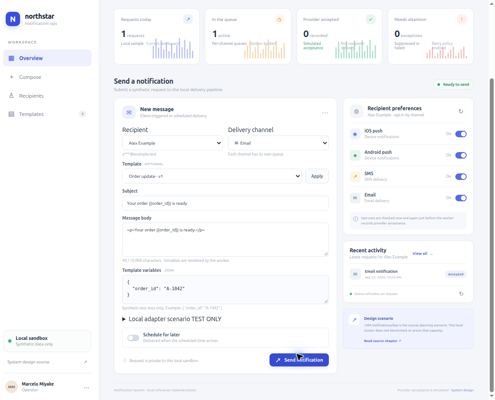

# Notification System Local Reference Implementation

This repository implements a local educational notification platform based on the [ByteByteGo System Design Interview chapter](https://bytebytego.com/courses/system-design-interview/design-a-notification-system). It supports iOS push, Android push, SMS, and email through recording adapters; scheduled and immediate requests; recipient preferences; versioned templates; idempotency; bounded retries; and delivery history.

A complete document map is available in the [Documentation index](docs/README.md).

The chapter's 10 million push, 1 million SMS, and 5 million email notifications per day are an architecture and capacity-planning scenario. Local Kind results are reported separately and do not establish that throughput.

## Contents

- [Repository map](#repository-map)
- [Local run](#local-run)
- [Scope and attribution](#scope-and-attribution)
- [Prerequisites for build and use](#prerequisites-for-build-and-use)
- [Deploy and undeploy](#deploy-and-undeploy)
- [Screenshots](#screenshots)
- [AI development disclaimer](#ai-development-disclaimer)

## Repository map

- [`docs/system-design.md`](docs/system-design.md) is the canonical design and decision record, including Mermaid architecture and lifecycle diagrams.
- [`docs/openapi.yaml`](docs/openapi.yaml) is the HTTP contract.
- [`notification-api/`](notification-api/README.md) owns caller-facing notification management.
- [`notification-worker/`](notification-worker/README.md) owns scheduling, outbox dispatch, queue consumption, retries, and recorded outcomes.
- [`notification-frontend/`](notification-frontend/README.md) is the Vue operator console.
- [`deploy/helm/notification-system/`](deploy/helm/notification-system/README.md) deploys the application and local dependencies to Kind.
- [`docs/verification/`](docs/verification/) contains test, quality, and Jev evidence.

Each application has its own `README.md`, `AGENTS.md`, Dockerfile, and service tests. Root and service guidance describe the development workflow and ownership boundaries.

## Local run

Requirements: Docker, Rust stable, Node.js/pnpm, Helm, Kind, and kubectl. The checked-in chart uses one PostgreSQL and one RabbitMQ instance, plus at least two replicas for each application Deployment. It creates no public ingress.

```sh
kind get clusters
docker build -t notification-api:local ./notification-api
docker build -t notification-worker:local ./notification-worker
docker build -t notification-frontend:local ./notification-frontend
kind load docker-image notification-api:local notification-worker:local notification-frontend:local --name kind
helm upgrade --install notification-system ./deploy/helm/notification-system \
  --namespace notification-system --create-namespace
kubectl -n notification-system rollout status deployment/notification-api
kubectl -n notification-system rollout status deployment/notification-worker
kubectl -n notification-system rollout status deployment/notification-frontend
kubectl -n notification-system port-forward service/notification-frontend 8080:80 --address 127.0.0.1
```

Open <http://127.0.0.1:8080>. The local synthetic caller key is `local-dev-api-key`. Do not reuse it outside an isolated local cluster. For unit, integration, frontend, Kind, SonarQube, and manual verification commands, see the service READMEs and [`docs/verification/README.md`](docs/verification/README.md).

Local recording adapters confirm simulated provider acceptance only. They do not contact APNs, FCM, an SMS provider, or an email provider and do not claim that a recipient received a message. Queue processing is at-least-once; provider side effects can be duplicated in real integrations.

## Scope and attribution

This is a local learning/reference implementation, not a production launch. Use synthetic recipients only. Real channel providers, production multi-tenancy, production HA/backups, and a benchmark proving the chapter's daily volume are out of scope. The design draws its requirements from the linked ByteByteGo chapter; implementation choices and local evidence are documented separately.

Commits follow [Conventional Commits 1.0.0](https://www.conventionalcommits.org/en/v1.0.0/).

## Prerequisites for build and use

- **Build and deploy:** Docker, an existing Kind cluster named `kind`, kubectl, Helm, Rust stable, Node.js, and pnpm.
- **Use:** the deployed local stack, a browser, loopback port-forward access, and the synthetic local API key documented above.

## Deploy and undeploy

Build and install the local release with the commands in [Local run](#local-run), or use `./scripts/kind-deploy.sh` from the repository root. Open the forwarded frontend in a browser and use synthetic recipients only. The chart's CPU and memory requests and limits are listed in [Kubernetes resource budgets](docs/kubernetes-resources.md).

To remove the application while retaining database and queue data, stop the port-forward with Ctrl-C and run:

```sh
helm --kube-context kind-kind uninstall notification-system --namespace notification-system
```

The chart retains PostgreSQL and RabbitMQ PVCs. Do not delete the namespace when those claims must remain available; deleting the claims permanently removes their local data.

## Screenshots




## AI development disclaimer

> **AI development disclaimer:** This project was built entirely with GPT-6 Luna at Max effort as a proof of concept exploring how low-cost AI plans can be useful when paired with disciplined harness and loop engineering. This is project-owner attribution; repository contents do not independently verify runtime model metadata. Review AI-generated design and code before relying on them.
