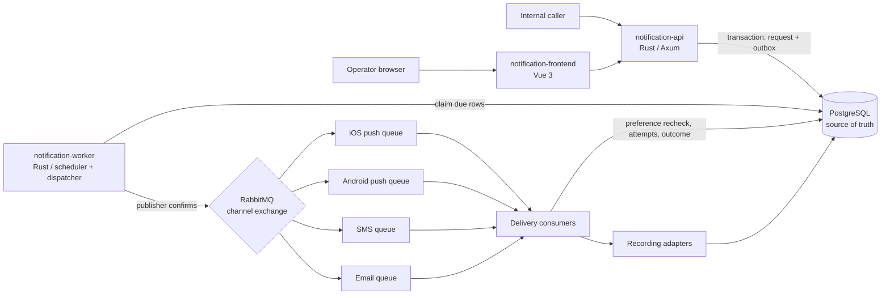
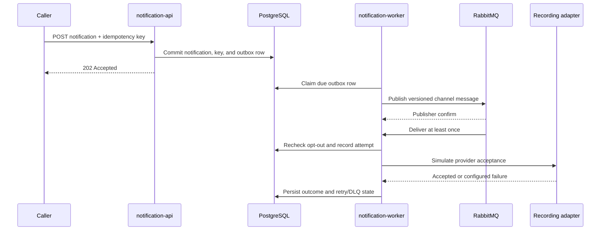

# Notification System — System Design RFC

| Field | Value |
|---|---|
| Status | Proposed local reference implementation |
| Owner | Repository maintainers |
| Last updated | 2026-09-24 |
| Related design | [ByteByteGo: Design a Notification System](https://bytebytego.com/courses/system-design-interview/design-a-notification-system) |
| Scope | A local, synthetic-data notification platform with four isolated delivery channels, durable handoff, scheduling, opt-outs, and observable retries. |

> Project documentation index: [Documentation index](README.md)

> Project decision records: [ADR index](adr/README.md).

> Database tables, columns, and ownership: [Database model](database-model.md).

## Contents

- [1. Abstract](#1-abstract)
- [2. Goals and non-goals](#2-goals-and-non-goals)
- [3. Background, requirements, and assumptions](#3-background-requirements-and-assumptions)
- [4. Proposed architecture and ownership](#4-proposed-architecture-and-ownership)
- [5. Request lifecycle](#5-request-lifecycle)
- [6. API and data contracts](#6-api-and-data-contracts)
- [7. Consistency, idempotency, and replay](#7-consistency-idempotency-and-replay)
- [8. Security and privacy](#8-security-and-privacy)
- [9. Operational readiness](#9-operational-readiness)
- [10. Alternatives considered](#10-alternatives-considered)
- [11. Open questions](#11-open-questions)
- [12. Decision and next steps](#12-decision-and-next-steps)
- [References](#references)

## 1. Abstract

This design provides a local, educational notification platform for applications that need to submit immediate or scheduled messages across iOS push, Android push, SMS, and email. A Rust/Axum Notification Management API authenticates callers, enforces request-level limits, validates recipient preferences and templates, persists accepted requests, and writes transactional outbox records. A separate Rust delivery worker publishes due outbox records to per-channel RabbitMQ queues, rechecks opt-outs, uses local recording adapters, and persists attempts and outcomes. A Vue operator console drives and inspects the same API.

PostgreSQL is authoritative for recipients, device registrations, preferences, template versions, notification state, the outbox, attempts, and recorded adapter results. RabbitMQ buffers and isolates channel work; it is not the source of truth. The delivery guarantee is at-least-once processing. An adapter acceptance is not proof of final device/carrier/mailbox delivery.

### Workload and constraints

The referenced chapter describes 10 million mobile push notifications, 1 million SMS, and 5 million email messages per day (16 million/day total), soft real-time delivery, iOS/Android/desktop recipients, client-triggered and server-scheduled requests, and user opt-outs. The volume is a planning scenario only. The local single-node Kind cluster, recording adapters, sample recipients, and test load do not prove production-scale capacity or availability.

This reference excludes real APNs/FCM/SMS/email integration, production multi-tenancy, public ingress, production HA/backups, engagement analytics, and a benchmark proving 16 million sends/day. It uses synthetic data, one local PostgreSQL instance, and one local RabbitMQ instance. Three app Deployments run at two replicas each.

## 2. Goals and non-goals

| Goals | Non-goals |
|---|---|
| **G1 — Traceability:** map chapter requirements to API behavior, state, and tests. | **NG1 — Provider delivery:** no real provider SDKs, credentials, or claim of recipient delivery. |
| **G2 — Durable acceptance:** persist an accepted request and outbox event atomically; reject conflicting idempotency-key reuse. | **NG2 — Production scale:** no capacity claim based on the 16M/day scenario or local Kind. |
| **G3 — Isolation:** route iOS push, Android push, SMS, and email through distinct queues. | **NG3 — Production HA:** no replicated database/broker, DR, backup, or multi-region topology. |
| **G4 — Recipient control:** honor opt-outs both at API acceptance and immediately before dispatch. | **NG4 — External analytics:** no opens/clicks or proof of device receipt. |
| **G5 — Local operations:** run via Helm on Kind with loopback-only frontend access, health checks, logs, metrics, and reproducible tests. | **NG5 — Public tenancy:** no tenant provisioning or internet-facing endpoint. |
| **G6 — Quality evidence:** unit, integration, frontend, Kind E2E, and per-service Sonar evidence. | **NG6 — Redis:** no cache before measured read load justifies added state. |

## 3. Background, requirements, and assumptions

### Source facts

The ByteByteGo chapter asks for push, SMS, and email; iOS and Android push paths; soft real-time behavior; client-triggered and server-scheduled events; user opt-out; contact/device collection; authenticated sender APIs; queues and workers; retries; persisted logs; templates and preferences; and queue monitoring. It identifies initial single-server failure, scaling, and processing bottlenecks, then proposes separate data/cache, horizontally scaled notification servers, queues, workers, and provider services. It explicitly notes duplicate delivery can occur and recommends event-ID deduplication. See the linked chapter for the original illustrations and full discussion.

### Requirement traceability

| ID | Requirement | Design decision | Acceptance evidence |
|---|---|---|---|
| R-01 | Four destinations: iOS push, Android push, SMS, email | Four enum values and four Rabbit queues | Unit routing tests; integration queue isolation; Kind channel flows |
| R-02 | Client-triggered send | Authenticated `POST /api/v1/notifications` | API integration and frontend E2E |
| R-03 | Server-side scheduling | Persist `scheduled_at`; dispatcher publishes only when due | Scheduler unit and Kind schedule flow |
| R-04 | Soft real-time and burst buffering | PostgreSQL outbox + channel-specific Rabbit queues | Outbox recovery and queue tests; backlog metrics |
| R-05 | Respect user opt-outs | Reject at acceptance; worker rechecks before provider call | API and worker tests; E2E suppression |
| R-06 | Contact/device registration | Recipient plus multiple device records | API contact/device endpoints and unit/integration tests |
| R-07 | Caller authentication and abuse control | API key, per-caller in-process rate limit for local MVP | Auth/rate-limit API tests; production limitation documented |
| R-08 | Templates and reusable content | Versioned template management; notification pins template version | Template unit/API tests; rendering test |
| R-09 | Retry provider errors | Bounded exponential backoff for transient failures; terminal permanent failures; DLQ | Retry unit/integration and E2E cases |
| R-10 | Persist notification log | PostgreSQL notification/attempt/recorded-delivery rows | Persistence/restart integration tests |
| R-11 | Avoid lost work across DB/broker boundary | Transactional outbox, confirm before marking published, periodic reclaim | Outbox recovery and worker restart tests |
| R-12 | Monitor queue and execution health | Health endpoints, structured logs, Prometheus metrics and Rabbit metrics | Kind checks and verification note |

### Assumptions

- Caller identity is represented by one local demo API key in Kind; it is not production multi-tenancy.
- Recipients are pre-registered synthetic records. Push devices may have multiple tokens per recipient.
- “Accepted” means validated and durably stored, not delivered. A preference may change after acceptance, so the worker rechecks it.
- A recording adapter stores the rendered envelope and returns a simulated provider acceptance. Test fixtures may request transient or permanent outcomes through an explicit local-only simulation field.
- User content and contact details are sensitive and must not be written to logs. A real deployment would define retention, consent, lawful basis, provider credentials, and residency policies.
- Local event rate limits are process-local. Horizontal replicas do not create an aggregate global rate limit; production would add a shared limiter only after an explicit capacity/security design.

## 4. Proposed architecture and ownership

The Helm chart runs two replicas each of API, worker, and frontend. API replicas share PostgreSQL; workers coordinate outbox claims with `FOR UPDATE SKIP LOCKED`. The local UI and API have ClusterIP services only. The frontend is reached through a loopback-bound `kubectl port-forward`.

| Component | Bounded context and owned behavior | Primary state | Failure behavior |
|---|---|---|---|
| `notification-api` | **Notification Management:** caller authentication/rate limiting; recipient/device contact data; preferences; template versions; payload validation; idempotency; accepted request state | PostgreSQL tables `callers`, `recipients`, `devices`, `preferences`, `templates`, `notifications`, `idempotency_keys`, `outbox` | Fails closed if database or required preference state is unavailable. Transaction rollback prevents accepted-without-outbox state. |
| `notification-worker` | **Delivery:** schedules due items; relays outbox records; routes channel messages; rechecks preference; records attempts/results; retry policy and DLQ | PostgreSQL `outbox`, `notifications`, `delivery_attempts`, `recorded_deliveries`; RabbitMQ queue state is transient | Requeues transient delivery errors with bounded exponential delay; permanently failed or exhausted items are terminal and copied to channel DLQ. Worker restarts recover from database and broker acknowledgments. |
| `notification-frontend` | Operator inspection and local synthetic request/preferences/template operations; no policy authority | None | Shows loading, empty, validation, unauthorized, dependency, and partial/error states. API remains authoritative. |
| PostgreSQL | Durable system record | Persistent volume in local chart | Single instance only; outage stops acceptance and processing. No HA claim. |
| RabbitMQ | Burst buffer and channel isolation | Broker queues; outbox is recovery source | Broker outage delays dispatch; unconfirmed publication remains retryable in outbox. DLQ preserves terminal messages. |
| Recording adapters | Simulated acceptance by channel | `recorded_deliveries` | Configurable local transient/permanent errors exercise retry behavior; no external network/provider calls. |

**Data ownership:** the API owns caller, recipient/device, preference, template, idempotency, and accepted-request rows. The worker owns delivery attempt/outcome rows and outbox publication lifecycle. Both contexts can update notification lifecycle fields through explicit transitions; no service writes another context's tables except the shared notification row defined by the state contract. PostgreSQL is authoritative; Rabbit is rebuildable transport. Redis is deferred until read-load evidence.

## 5. Request lifecycle

1. A caller submits `POST /api/v1/notifications` with `X-API-Key`, `Idempotency-Key`, recipient, channel, template reference or content, variables, and optional future `scheduled_at`.
2. API authenticates the caller, applies its local rate bucket, validates channel/payload/time, and calculates a canonical request hash. It resolves recipient/contact, template version, and current preference from PostgreSQL.
3. Missing recipient, invalid template, malformed content, or opted-out channel is rejected. A repeated idempotency key with matching caller and payload returns the existing notification; a different payload for that key returns `409 Conflict`.
4. In one transaction, the API writes the notification snapshot, idempotency mapping, and outbox row. A future request's `available_at` is its scheduled timestamp. Only commit permits a `202 Accepted` response.
5. Worker instances claim due outbox rows using a lease/`FOR UPDATE SKIP LOCKED`, publish to a durable channel-specific queue, and wait for publisher confirmation before marking the row published. Unconfirmed or crashed publications remain reclaimable. The consumer deduplicates by notification ID and increments delivery attempt count.
6. Before provider simulation, the worker checks the recipient preference again. If disabled, it records `suppressed` without calling an adapter. Otherwise it loads the pinned template snapshot, renders variables, and invokes that channel's recording adapter.
7. Adapter success stores the envelope/result, attempt, and accepted outcome. Transient errors use bounded exponential retries and eventually a channel DLQ; permanent errors are terminal immediately. Worker state updates are idempotent by notification/event/attempt ID.
8. The API exposes current status. Structured logs omit contact/payload data; metrics include acceptance counts, queue depth, due age, retry counts, suppression, and terminal failures.

## 6. API and data contracts

OpenAPI source: [`docs/openapi.yaml`](openapi.yaml).

| Contract | Fields / rules |
|---|---|
| Notification request | `recipient_id` UUID, `channel` enum (`ios_push`, `android_push`, `sms`, `email`), optional `template_id`, optional `template_version`, `variables` object, optional future `scheduled_at` UTC RFC 3339, optional local simulation behavior. Exactly one of template reference or inline `subject`/`body` is required. |
| Required headers | `X-API-Key`; `Idempotency-Key` for POST (1–128 visible ASCII chars). |
| Accepted response | HTTP `202`, `notification_id`, status `accepted` or `scheduled`, `created_at`. |
| Conflict | HTTP `409` when the idempotency key exists for this caller but the canonical payload hash differs. |
| Status | `GET /api/v1/notifications` supports recipient/status/channel/time filters and bounded pagination; `GET /api/v1/notifications/{id}` returns lifecycle state and attempts (never secret/contact values beyond masked destination). |
| Preferences | `GET/PUT /api/v1/recipients/{recipient_id}/preferences/{channel}`. API key auth required; channel opt-in is checked again in worker. |
| Templates | `GET/POST /api/v1/templates`; new content creates an immutable incremented version. Notifications pin the selected version at acceptance. |
| Contact data | `GET/PUT /api/v1/recipients/{id}` and `POST/DELETE /api/v1/recipients/{id}/devices` for synthetic user data and multiple devices. |

Database ownership and core tables are in the architecture section and SQL migrations. Timestamps use UTC; IDs are UUIDs. Notification payloads retain template version and normalized variables for audit/replay. The API schema is versioned under `/api/v1`; incompatible changes require a new version.

### Contract guarantees

- PostgreSQL commit is the acceptance boundary; no successful response precedes durable request/outbox state.
- Idempotency scope is `(caller_id, idempotency_key)`. Equal canonical request returns the same notification; changed payload conflicts.
- Scheduled work is ineligible for dispatch before `scheduled_at`. Queue order is best effort; per-recipient cross-channel ordering is not promised.
- Each queue message includes a stable notification ID and schema version. Consumer state and attempt records tolerate redelivery.
- Template version and request payload are pinned at acceptance; later edits do not silently change queued content.
- Notification state is the durable lifecycle authority. RabbitMQ delivery/ack is transport state only.

### Contract ownership and consumers

| Interface | Owner | Producer | Known consumers by repository/component | Authority |
| --- | --- | --- | --- | --- |
| Notification Management REST API | `notification-system` / `notification-api` | `notification-api` | Same repository: `notification-frontend`; other-repository consumers: unknown | [OpenAPI](openapi.yaml) and API implementation |
| Versioned delivery message and channel queues | `notification-system` / `notification-api` owns accepted outbox shape; `notification-worker` owns consumption and outcome | API outbox relay / `notification-worker` | Same repository: `notification-worker`; other-repository consumers: unknown | [Contract catalog](contracts/README.md) and API/worker source |
| PostgreSQL lifecycle schema | Shared explicitly for notification lifecycle rows; otherwise each service owns its tables | `notification-api`, `notification-worker` | Same repository: those two services; other-repository consumers: none by design because this is internal state | [SQL migrations](../database/migrations/) and ownership rules above |

See the [contract catalog](contracts/README.md) for compatibility and consumer details.

## 7. Consistency, idempotency, and replay

| Scenario | Expected behavior | Reason |
|---|---|---|
| Same caller/key and same normalized request | Return original notification ID/status | Stable request result without duplicate accepted work |
| Same caller/key and changed payload | `409 Conflict`; keep original unchanged | Prevent ambiguous key reuse |
| Crash after DB commit before publish | Outbox remains unpublished and later dispatches | DB and broker are not a distributed transaction |
| Publish confirmed but worker crashes before marking outbox | Duplicate queue publication is possible; consumer dedupes by notification ID/state | At-least-once transport avoids loss |
| Preference disabled after request acceptance | Worker suppresses before adapter call | Respect the latest user choice |
| Transient provider simulation error | Bounded exponential retry, then DLQ/failed after maximum | Avoid infinite redelivery and isolate channel failure |
| Permanent provider simulation error | Record terminal failure without retry | Retrying invalid destination/content is not useful |
| Template edited after acceptance | Use selected immutable version | Reproducible audit and replay |

“Exactly once” external delivery is not guaranteed. Even with idempotent internal state, a real provider may accept a call and the worker may fail before recording its response. Real adapters need provider idempotency keys when supported and reconciliation for ambiguous outcomes.

## 8. Security and privacy

- Require the API key for all mutating/administrative routes. The local static key is only a fixture. Production caller identity, key rotation, authorization and aggregate rate limiting are unresolved product/security requirements.
- Use synthetic contacts only. Do not log request body, message body, phone, email, device token, or API key. Status responses mask destinations.
- Keep provider credentials absent. The local adapter has no outbound provider access. Kubernetes configuration stores only local development settings; a production secret-management design is out of scope.
- Validate bounded body size, channel, template references, variable types, destination format, and schedule range. Avoid rendering arbitrary templates/code.
- Operator UI is private through local port-forward, with no public ingress. Protect API calls even in development.
- Data retention/deletion and consent evidence need product/legal ownership before production; this local chart's PVC persists until explicitly removed.
- Review all Sonar security hotspots before marking them reviewed; do not include secrets in scans or artifacts.

## 9. Operational readiness

| Signal | Local success check / proposed production SLO | Owner | Gate |
|---|---|---|---|
| Acceptance correctness | Every `202` has durable notification + outbox; no accepted record after forced transaction rollback | API | Required |
| API health/readiness | `/healthz` live; `/readyz` validates PostgreSQL and broker reachability as configured | API | Required |
| Queue depth and oldest age | Inspect each channel and DLQ separately; alert on sustained oldest-age growth | Worker | Required |
| Retry and terminal failure | Track attempts by channel/error class; bounded attempts; alert on terminal spike | Worker | Required |
| Scheduled lag | Track `now - scheduled_at` for due queued notifications | Worker | Required |
| Preference suppression | Count suppressions without recipient identifiers | API/worker | Required |
| Data integrity/recovery | Reconcile unpublished outbox, stuck leases, notification/attempt state on worker restart | Worker | Required |
| Sonar quality gate | >=80% coverage, <3% duplication, zero new blocker/critical issues, reviewed hotspots | Service owners | Required for baseline |
| Rollback | Helm revision rollback; preserve local PVC; do not reset DB during app rollback | Operator | Required for Kind exercise |

The numeric availability/latency SLOs are not established by this local exercise. The chapter describes soft real-time behavior but does not provide a measurable target. Pick a production target only after workload/region/provider objectives are supplied.

### Resource budgets and Kubernetes practice

Every pod template has CPU and memory requests and limits for each regular and init container. The concrete local values are maintained in [Kubernetes resource budgets](kubernetes-resources.md); they are local defaults, not measured consumption or production sizing. Measure representative workloads in the target environment, set requests for observed baseline needs and limits for acceptable bursts, then monitor CPU throttling, memory pressure, and OOM events and adjust deliberately.

## 10. Alternatives considered

| Alternative | Why considered | Why not selected |
|---|---|---|
| One notification service handles every channel inline | Small first implementation | Couples provider latency and outage domains; cannot independently buffer/scale channel work. |
| One shared queue for all channels | Fewer broker resources | A blocked provider can delay unrelated channels; the chapter explicitly recommends independent queues. |
| Direct publish after database write | Simple code path | Crash between DB commit and publish loses work; use transactional outbox. |
| Redis cache in first iteration | Chapter discusses caching contact/template data | Adds coherence and infrastructure before local read load is measured; PostgreSQL remains authoritative. |
| Real providers | Demonstrates external delivery | Requires credentials, legal/provider setup, and live PII; recording adapters give safe repeatable local evidence. |
| In-process database work queue only | Avoids broker dependency | Does not exercise requested channel queue isolation, routing, or DLQ behavior. |

### Architecture practice fit

DDD is useful here because Notification Management and Delivery own different policies and failure/retry lifecycles. Keep Clean Architecture lightweight: protect acceptance, idempotency, opt-out, and delivery-state rules from Axum, SQL, and RabbitMQ details, but do not add a layer or interface for every request type. Full CQRS is not justified: the API and worker must agree on one durable notification lifecycle, and current indexed PostgreSQL reads meet the local operator needs. Add a read projection only if measured query load or latency requires one and its freshness rules can be stated. Apply YAGNI, KISS, and DRY by keeping the outbox, four queues, and shared lifecycle fields only where they satisfy explicit guarantees.

## 11. Open questions

1. What production caller/tenant identity, authorization scopes, key rotation, and globally shared rate limit are required?
2. What retention, deletion, consent, and data residency rules apply to contacts, templates, and delivery logs?
3. What provider adapters, regional fallbacks, and provider idempotency/reconciliation capabilities are approved?
4. What production availability, queue-age, delivery-latency, and daily peak objectives should be tested?
5. Which operational roles may inspect, replay, or delete notifications, and what audit trail is required?

These questions block production use, not this local synthetic reference implementation.

## 12. Decision and next steps

Use a Rust API and worker with independent Notification Management and Delivery bounded contexts, PostgreSQL as source of truth, a transactional outbox, four RabbitMQ queues, local recording adapters, and a Vue operator console. Deploy through Helm to the existing local Kind cluster with two replicas per application Deployment and single-instance local dependencies. Keep the chapter's volume as a scenario only.

| Milestone | Deliverable | Exit evidence |
|---|---|---|
| M1 — Contracts and domain | Requirement trace, OpenAPI, state model, migrations, unit tests | Invariants and idempotency/preferences/template/retry tests pass |
| M2 — Services and frontend | API, worker, recording adapters, operator UI and per-service READMEs/guidance | Unit and integration suites pass; UI accessible and frontend tests pass |
| M3 — Local cluster | Helm chart, Kind deployment, queue/db health and loopback UI | All three app Deployments have 2 ready replicas; end-to-end scenarios pass |
| M4 — Quality evidence | SonarQube projects/gate, analysis reports, Jev note | Actual revision/results recorded; hotspot and coverage state disclosed |
| M5 — Document review | Markdown System Design, contracts, and operations documentation | Check source links, diagrams, commands, and ownership against the implementation |

## References

- [ByteByteGo, “Design a Notification System”](https://bytebytego.com/courses/system-design-interview/design-a-notification-system) (course source reviewed in the authenticated browser on 2026-09-24).
- [Conventional Commits 1.0.0](https://www.conventionalcommits.org/en/v1.0.0/).
- [OpenDesign](https://github.com/nexu-io/open-design) (prototype workflow; not a runtime dependency).
- [Jev Score documentation](https://docs.typesafe.ai/primitives/score).
- User workflow guide: [Creating System Design Documents with AI](https://marcelomiyake.com.br/posts/ai-system-design-documents/).
